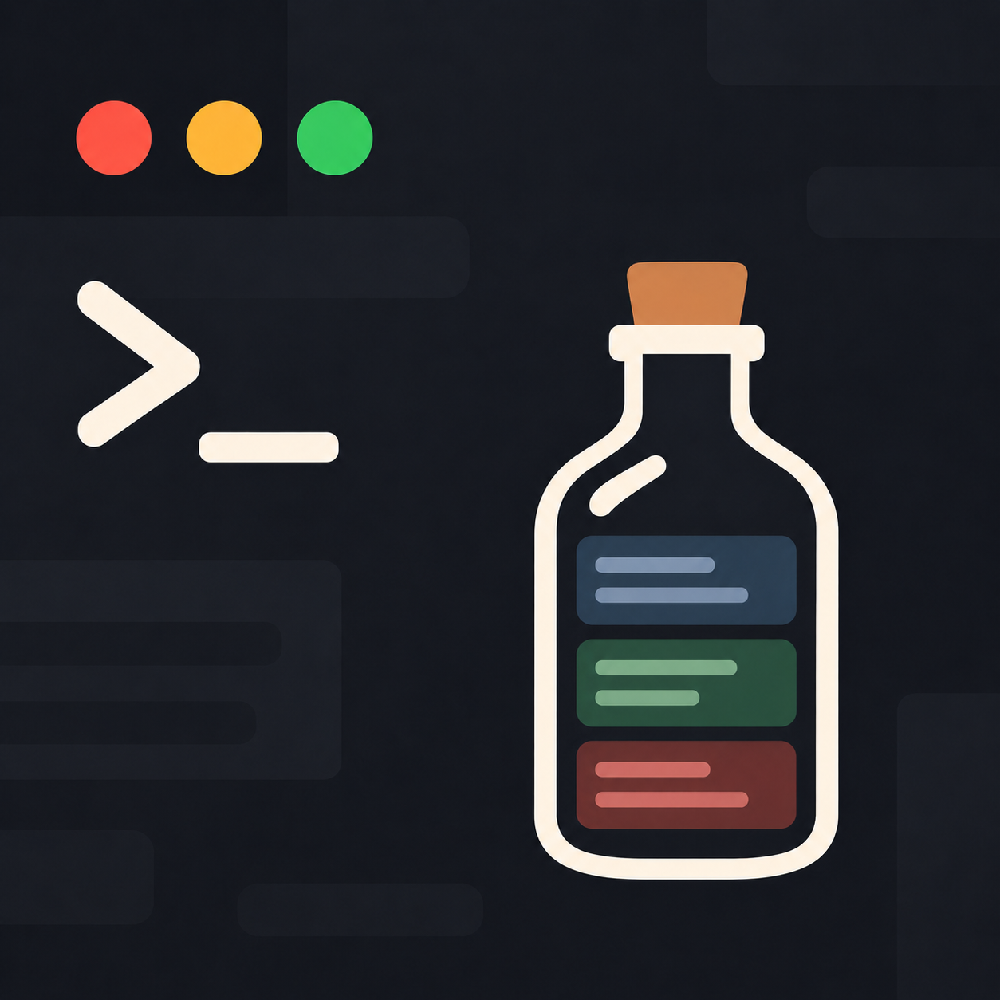

<p align="center">
  
</p>

<p align="center"><strong>botttle</strong></p>

<p align="center">
  An agentic development environment — a terminal workspace with tabs and panes,
  built in Rust on <a href="https://gpui.rs">GPUI</a>.
</p>

---

## What this is

botttle is a GPU-rendered terminal you can split and tab like an editor, built to
grow into a place where agents work next to you rather than in a separate window.

The terminal comes first, because everything an agent does in a development loop —
running builds, reading logs, driving tools — already happens in one. The pane
tree, tab model, and event plumbing are the parts that outlive the terminal.

## Status

Early. What works today:

- Real PTYs — each pane runs your login shell through a full ANSI emulator
  (`alacritty_terminal`), with 24-bit color, text attributes, and 10k lines of
  scrollback.
- **Tabs**, each holding its own pane layout.
- **Splittable panes** — split right or down, any depth; splitting along an axis a
  pane already lives on adds a sibling instead of nesting.
- Mouse selection (click, double-click for words, triple-click for lines), copy
  and paste, scrollback via the wheel, live font resizing.
- **Image paste for coding CLIs** — `ctrl-v` with an image on the clipboard writes
  it to a file and types the path, which is how Claude Code and Codex take
  images. With no image on the clipboard, `ctrl-v` reaches the program unchanged.
- A focused pane is marked by its border, so you can see where input will land.
- A titlebar of its own, and a tab bar that scrolls horizontally once tabs fill it
  (the active tab is scrolled into view when you switch with the keyboard).
- **12 themes** — six families in light and dark — and a **settings screen**.
- Window title tracking (OSC 0/2), clipboard escapes (OSC 52), and color queries.

Not there yet: IME composition, drag-to-resize splits, search, and the agent layer
itself.

## Themes

Botttle, Gruvbox, One, Cursor, OpenCode, and VS Code, each in a light and a dark
variant. Gruvbox, One, and VS Code use those projects' published terminal
palettes; Cursor and OpenCode are approximations matched by eye.

## Settings

`⌘,` (or `ctrl+shift+,`) opens the settings screen, and every change is written
straight to `~/.config/botttle/settings.json`:

- **Appearance** — theme, and a background override that replaces the window and
  terminal grounds while leaving the chrome readable.
- **Typography** — terminal and interface font families (the terminal list is
  filtered to likely monospace families, with a toggle to show every installed
  one), sizes, line height, and ligatures.
- **Terminal** — cursor shape (block, bar, underline), image paste, and
  scrollback depth.

The file is plain JSON and can be edited by hand; unknown or missing keys fall
back to defaults.

## Running it

```bash
cargo run --release
```

Requires a recent stable Rust toolchain. On Linux, GPUI needs the usual Wayland or
X11 development packages.

On macOS, wrap it in an app bundle to get the icon in the dock and a real entry in
Cmd-Tab:

```bash
scripts/bundle-macos.sh && open target/botttle.app
```

## Keys

`⌘` on macOS; `ctrl+shift` elsewhere.

| Chord | Action |
| --- | --- |
| `⌘T` | New tab |
| `⌘W` | Close pane (closes the tab with the last pane) |
| `⌘⇧W` | Close tab |
| `⌘D` / `⌘⇧D` | Split right / split down |
| `⌘]` / `⌘[` | Focus next / previous pane |
| `⌘⇧]` / `⌘⇧[` | Next / previous tab |
| `⌘C` / `⌘V` | Copy selection / paste (image if the clipboard holds one) |
| `ctrl-V` | Paste a clipboard image as a file path |
| `⌘K` | Clear |
| `⌘=` / `⌘-` / `⌘0` | Font size |
| `⌘,` | Settings (`esc` closes) |

Everything else goes to the shell untouched, including bare `ctrl` chords.

## Layout

```
crates/botttle
├── main.rs          window setup and app wiring
├── assets.rs        the logo, compiled into the binary
├── workspace.rs     root view: titlebar, tab bar, status bar, actions
├── pane.rs          the pane tree (split, close, collapse, render)
├── actions.rs       actions and their default key bindings
├── settings.rs      user settings, persisted as JSON
├── settings_view.rs the settings screen
├── theme/           the resolved look: palettes, fonts, sizing
└── terminal/
    ├── mod.rs       PTY + emulator, and the bridge to the main thread
    ├── view.rs      grid rendering, keyboard, mouse, selection
    ├── keys.rs      keystrokes to terminal byte sequences
    ├── image_paste.rs clipboard images to files on disk
    └── color.rs     ANSI colors to gpui colors
```

## Assets

`assets/logo.png` is the source image: the README header, and the app icon the
bundle script slices into an `.icns`. A 256px copy is embedded in the binary
(`crates/botttle/assets/logo-256.png`) and drawn in the titlebar.

## License

MIT — see [LICENSE](./LICENSE).
